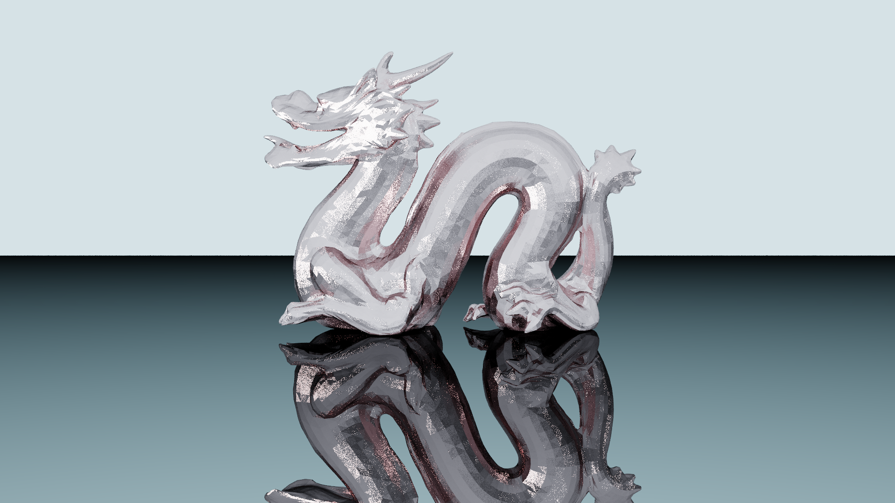

# Overview

I am a high school student and a coding hobbyist. This is arguably the most successful of my projects so far, and therefore, I would like to share my work with this open-source community, thus marking my first public repository.

# RayTraceTriangles

This is a low-level, numba-based, python ray tracing project that runs on CPU. The project is named ```RayTraceTriangles``` because this is a cloned project to another private repository (that too made by me) that focusses on the ray tracing mechanics, and works only with spheres, this is an extension to that project, now working with triangles.

## Features

- **Ray Tracing**: Models physics of light rays by using a combined method of utilizing both shadow rays as well as path tracing
- **BVH Acceleration**: Bounding Volume Hierarchy for efficient ray-triangle intersection
- **Material System**: Support for reflective surfaces which also consists of factors such as luminance and reflectivity for objects
- **OBJ Loader**: Import 3D models from OBJ files with transformations, utilizing the ```Object``` class in ```world.py```
- **Multi-sample Rendering**: Uses a monte-carlo like method to shoot multiple rays from each pixel, each with a slight deviation
- **Direct Illumination**: Shadow ray casting for direct light calculation, as well computationally-heavy path tracing

## Project Structure

- `bvh.py` - BVH tree construction and ray-box intersection
- `tracer.py` - Core ray tracing and rendering pipeline
- `triangles.py` - Triangle-ray intersection calculations
- `camera.py` - Camera ray initialization
- `world.py` - 3D object loading and transformation
- `renderer.py` - Image output and tone mapping
- `utils.py` - Shared math utilities (vector operations), optimized for utilization with ```numba```

## Usage

```python
# Load scene objects
obj = Object("model.obj", name="Model")
obj.translate(x, y, z)
obj.rotate(theta, phi)
obj.scale(factor)

# Build BVH and render
bvh, tri_indices = run_split(triangles, max_iter=100)
img = trace_rays(height, width, num_rays_per_pixel, num_bounces, world, source_idx, materials, fov, bvh, tri_indices)
render(img, "output.png")
```
Also check the examples for more information.

## Data Structures

### World Array
The world is represented as a 2D numpy array where each row represents a triangle with 13 elements:
- `[0]` - Material ID (index into materials array)
- `[1:4]` - Vertex A (x, y, z)
- `[4:7]` - Vertex B (x, y, z)
- `[7:10]` - Vertex C (x, y, z)
- `[10:13]` - Normal vector (nx, ny, nz)
- Row ```0``` corresponds to sky, sky can be related with ambient color, if the ray misses all the triangles in the scene, this sky color is returned.
- The rows ```[0, 1, 2]``` are termed as ```VIP_INDICES```. They aren't supposed to have bounding boxes as these are usually too huge, or too distant from the main model (usually the sky, plane and source).

### Materials Array
Materials are defined as a 2D numpy array where each row represents a material with 5 properties:
- `[0]` - Red channel (0.0 - 1.0)
- `[1]` - Green channel (0.0 - 1.0)
- `[2]` - Blue channel (0.0 - 1.0)
- `[3]` - Luminance (light emission strength)
- `[4]` - Reflectivity (0.0 = diffuse, 1.0 = mirror)

Example:
```python
materials = np.array([
    [0.53, 0.81, 0.92, 10.0, 0.0],    # Sky (cyan, emissive)
    [1.0, 1.0, 1.0, 1000.0, 0.0],     # Light source (white, bright)
    [0.95, 0.45, 0.45, 0.1, 0.75],    # Red matte-reflective
    [0.99, 0.99, 0.99, 100.0, 1.0]    # Mirror (white, reflective)
])
```

## Example Render



## Credits

Thanks to hackmans for the Stanford Dragon model, available at https://sketchfab.com/3d-models/stanford-dragon-pbr-5d610f842a4542ccb21613d41bbd7ea1. The model is licensed under .
